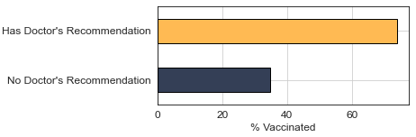

# Predicting the Seasonal Vaccine
### Maximizing Vaccine Uptake through Classification
<u><b>Authors:</b></u><br>
Paul Justafort<br>
Aung Si<br><br>
August 25<sup>th</sup>, 2023

---

## Contents

- [Introduction](#introduction)
- [The Data](#the-data)
- [Recall: Minimizing False Negatives](#recall-minimizing-false-negatives)
- [Results](#results)
    - [Feature Importances](#feature-importances)
    - [Addressing Opinions on the Seasonal Flu and the Vaccine](#addressing-opinions-on-the-seasonal-flu-and-the-vaccine)
    - [The Necessity of Doctor Recommendations](#the-necessity-of-doctor-recommendations)
    - [Age Group Delineation](#age-group-delineation)
- [Recommendations](#recommendations)
- [Next Steps](#next-steps)
- [Repository Structure](#repository-structure)

---


## Introduction 

Vaccines have long been a cornerstone of public health, shielding individuals and entire communities from a wide array of infectious diseases. Among these, the ongoing efforts to immunize against seasonal influenza stand out as a vital and complex undertaking. Unlike specific pandemic strains such as the 2009 H1N1 "swine flu," seasonal flu is a persistent and annually recurring challenge, necessitating vigilance and adaptation by medical professionals every year. Seasonal influenza vaccines are developed and distributed on an annual basis to combat the most common flu strains predicted to circulate during the upcoming flu season. Scientists and researchers analyze global flu trends, collecting samples and data to determine which strains are most likely to pose a threat. The composition of the seasonal flu vaccine is then tailored each year based on these predictions, making it a unique and dynamic tool in the fight against influenza.

In the United States, a coordinated effort involving the government, healthcare providers, public health organizations, and even private companies is launched each year to promote and provide seasonal flu vaccines. This expansive campaign includes public education, accessibility initiatives, and collaboration with healthcare professionals to ensure that vaccines reach as many people as possible. Guiding these efforts are robust data collection and analysis, including surveys and studies that closely monitor vaccination rates. One such resource is the National Seasonal Flu Survey, a comprehensive effort to gather information about individuals' vaccination status, as well as insights into their lives, opinions, and behaviors related to vaccination. In this analysis, we will delve into the data from this survey, applying statistical and analytical techniques to uncover patterns and trends in seasonal flu vaccination. By understanding the factors that influence people's decisions to get vaccinated, such as age, location, education, and beliefs about vaccines, we can craft targeted strategies to increase vaccination rates.

## The Data

The dataset utilized in this project originates from the National 2009 H1N1 Flu Survey (NHFS), conducted during the 2009-10 flu season. This telephone survey was designed to monitor influenza immunization coverage in the United States, specifically targeting individuals aged 6 months or older. A collaboration between the National Center for Immunization and Respiratory Diseases (NCIRD) and the National Center for Health Statistics (NCHS) under the Centers for Disease Control and Prevention (CDC), the NHFS collected information from October 2009 to June 2010. Its primary focus was to produce timely estimates of vaccination coverage rates for both the monovalent pH1N1 and trivalent seasonal influenza vaccines during the 2009-2010 flu season in response to the H1N1 pandemic. The CDC continues to monitor seasonal flu vaccination through other ongoing annual phone surveys, but the NHFS stands as a one-time survey created for this specific purpose.

For our exploration we're given two CSV's:
1. **Training Labels**: This one holds the binary labels we'll be training our model(s) to predict. There are two target labels, `'h1n1_vaccine'` and '`seasonal_vaccine'`— for this analysis we're only concerned with the latter. A $0$ indicates that the given respondent did not receive the respective vaccine while a $1$ indicates that the given respondent received the respective vaccine. This file shares the `'respondent_id'` column with the Training Features CSV.

2. **Training Features**: These are the features we'll be using to predict the probability of a respondent receiving a vaccine. There are 35 features and each is a response to a survey question. Features comprise various topics, such as behavioral (whether a respondent touches their face, washes their hand, etc.), opinion (whether the respondent believed the h1n1 vaccine was effective, etc.), and demographic.

## Recall: Minimizing False Negatives

In the context of vaccine uptake, minimizing false negatives is critical. A false negative occurs when the model incorrectly predicts that a person will not get vaccinated when, in reality, they would. This oversight could lead to missed opportunities for targeted interventions, like sending reminders or educational materials to those individuals. High false negatives could result in underutilization of resources and less effective vaccination campaigns. Recall is the metric that helps us measure this aspect of the model. It's calculated as the number of true positives divided by the sum of true positives and false negatives. A high recall score means the model is good at capturing the positive cases, thus minimizing false negatives. By focusing on minimizing false negatives, we aim to maximize the identification of individuals likely to get vaccinated, allowing for more targeted and effective vaccination campaigns.

In our project, we built eight different models, each with the primary goal of maximizing recall. The objective was to identify the model that could best minimize false negatives, thereby capturing as many individuals likely to get vaccinated as possible. We relied on cross-validation techniques to estimate how each model would perform on unseen data. After evaluating the recall scores of these models, we settled on the one with the highest recall score in cross-validation. This allows us to be more confident in the model's ability to minimize false negatives, thereby enabling more targeted and effective vaccination campaigns.

## Results

The model that we settled upon had a recall score of 75.52%, which is the highest we were able to make it. This meant that our best model was best equipped to minimize false negatives in our predictions, which is exactly what we wanted.

### Feature Importances

The top three features in predicting seasonal vaccine uptake were the opinion on the vaccine's effectiveness, the opinion on the vaccine's risk, and the doctor's recommendation for the vaccine. The opinion on the vaccine's effectiveness had the highest importance score, indicating that people's beliefs about how well the vaccine works significantly influence their decision to get vaccinated. The opinion on the vaccine's risk followed closely, suggesting that perceptions of risk associated with the vaccine are also a major factor. Lastly, the doctor's recommendation for the vaccine underlined the critical role healthcare providers play in influencing people's decision to get vaccinated. The following chart provides further insights into what most strongly influences seasonal vaccine uptake:


### Addressing Opinions on the Seasonal Flu and the Vaccine

In our findings, individuals who have a positive opinion about the effectiveness of the seasonal vaccine are approximately three times more likely to get vaccinated compared to those who don't share this belief:


This highlights the critical role that education plays in influencing vaccine uptake. Providing clear and accurate information about the vaccine's efficacy could substantially increase vaccination rates. Therefore, targeted educational campaigns that focus on the benefits and effectiveness of the seasonal vaccine are essential. This could include collaboration with healthcare providers who are often trusted sources of medical information, as well as using various media channels to disseminate factual data.

### The Necessity of Doctor Recommendations

Our analysis shows that individuals who received a doctor's recommendation for the seasonal vaccine are roughly twice as likely to get vaccinated compared to those who did not receive such advice:



This underscores the significant influence healthcare providers have on vaccination decisions. To capitalize on this, it's essential to equip doctors with the necessary resources and incentives to actively recommend the seasonal vaccine during consultations with patients. This could involve providing healthcare professionals with up-to-date information on vaccine efficacy and safety, as well as possibly implementing incentive programs to encourage this practice. The goal is to make the recommendation for seasonal vaccination a standard part of healthcare consultations.

### Age Group Delineation

Our data indicates that individuals aged 65 and older are more than twice as likely to get the seasonal vaccine compared to those aged 18 to 34. This suggests that age plays a significant role in the decision to get vaccinated:


To address this, targeted marketing campaigns could be developed to appeal specifically to younger age groups. Understanding that different age brackets may have different behavioral tendencies and motivations, such campaigns would aim to increase vaccine uptake across all age groups in a nuanced way. Tailoring the message to resonate with younger individuals could involve leveraging social media platforms or other channels that they frequently use. The aim is to create a broad-based approach that takes into account the behavioral differences among different age groups.

## Recommendations

Based on our findings, the following recommendations are suggested to increase seasonal vaccine uptake:

1. **Educational Campaigns**: Given the strong influence of people's opinions on vaccine effectiveness, targeted educational campaigns should be rolled out to provide clear and factual information on the benefits and efficacy of the seasonal vaccine.

2. **Healthcare Provider Involvement**: Doctors play a crucial role in influencing vaccination decisions. Resources and incentives should be provided to healthcare professionals to encourage them to recommend seasonal vaccination during patient consultations.

3. **Targeted Marketing for Different Age Groups**: With older individuals being more likely to get vaccinated, marketing strategies should be adapted to appeal to younger age groups. This could involve using platforms and messaging that resonate more with these demographics.

## Next Steps

For the next steps, it's imperative to dig deeper into more granular demographic and behavioral data. This will allow us to refine our targeting strategies and make our vaccination campaigns even more effective. A real-time monitoring system is also on the agenda; this tool will track vaccination rates across different groups and geographical areas, providing actionable insights for timely interventions.

Partnering with healthcare and community organizations will be crucial in rolling out these strategies. Their local reach and credibility can greatly amplify the effectiveness of our programs. To ensure that our efforts are yielding the desired outcomes, follow-up surveys should be conducted after the implementation of each campaign or initiative. These surveys will help us understand the impact of our actions and offer data for further refinements.

Lastly, continual optimization of our machine learning models is necessary. By incorporating more data and possibly exploring more advanced algorithms, we aim to improve the predictive accuracy of our models. This, in turn, will contribute to more effective and efficient vaccination campaigns, helping us reach our ultimate goal of increasing seasonal vaccine uptake.

## Repository Structure

```
.
|-- data/
|-- img/
|-- model_iteration/
|-- presentation/
|-- .gitignore
|-- index.ipynb
|-- LICENSE
|-- README.md
```